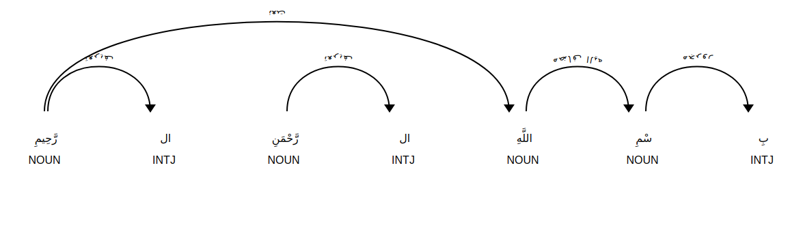
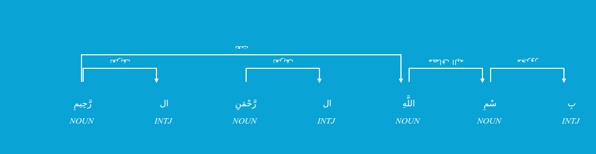

<!-- <h1 align="center">
  
   Dadmatools
</h1> -->

<h2 align="center">QuaranicTools: A Python NLP Library for Quranic NLP</h2>
<h3 align="center"><a href='language.ml'>Language Processing and Digital Humanities Lab (Language.ML)</a></h2>

<div align="center">
  <a href="https://pypi.org/project/quranic-nlp/"></a>
  <a href=""></a>
</div>

<div align="center">
  <h5>
      Part of Speech Tagging
    <span> | </span>
      Dependency Parsing
    <span> | </span>
      Lemmatizer
    <span> | </span>
      Multilingual Search    <br>
    <span> | </span>
      Quranic Extractions        
    <span> | </span>
      Revelation Order
    <span> | </span> <br>
      Embeddings (coming soon)
    <span> | </span>
      Translations    
  </h5>
</div>

# Quranic NLP

Quranic NLP is a computational toolbox to conduct various syntactic and semantic analyses of Quranic verses. The aim is to put together all available resources contributing to a better understanding/analysis of the Quran for everyone.

Contents:

- [Installation](#installation)
- [Pipline (dep,pos,lem,root)](#pipeline)
- [Format inputs](#format-inputs)
- [Example](#example)

## Installation

To get started using Quranic NLP in your python project, you may simply install it via the pip package.

### Install with pip

```bash
pip install quranic-nlp
```

You can check the `requirements.txt` file to see the required packages.

## Pipeline

The NLP pipeline contains morphological information e.g., Lemmatizer as well as POS Tagger and Dependancy Parser in a `Spacy`-like pipeline.

```python
from quranic_nlp import language

translation_translator = 'fa#1'
pips = 'dep,pos,root,lemma'
nlp = language.Pipeline(pips, translation_translator)
```

[`Doc`](https://spacy.io/api/doc) object has different extensions.
First, there are `sentences` in `doc` referring to the verses.
Second, there are `ayah` in `doc` which is indicate number ayeh in soure.
Third, there are `surah` in `doc` which is indicate name of soure.
Fourth, there are `revelation_order` in `doc` which is indicate order of revelation of the ayeh.
`doc` which is the list of [`Token`](https://spacy.io/api/token) also has its own extensions.
The pips is information to use from quranic_nlp.
The translation_translator is language for translate quran such that language (fa) or language along with \# along with number books.
For see all translate run below code
```python
from quranic_nlp import utils
utils.print_all_translations()
```
Quranic NLP has its own spacy extensions. If related pipeline is not called, that extension cannot be used.

## Format Inputs

There are three ways to format the input:

1. number surah along with \# along with number ayah.
2. name surah along with \# along with number ayah.
3. search text in quran.

Note The last two calls require access to the internet for an API call.

```python
from quranic_nlp import language

translation_translator = 'fa#1'
pips = 'dep,pos,root,lemma'
nlp = language.Pipeline(pips, translation_translator)

doc = nlp('1#1')
doc = nlp('حمد#1')
doc = nlp('رب العالمین')
```

## Example
Two examples are provided below to demonstrate the usage of the library:

First, Displaying data from Surah Al-Fatiha, Verse 1:
```python

first_doc = nlp('1#1')
```


Second, Displaying data from Surah Aal-i-Imran, Verse 200:
```python

second_doc = nlp('3#200')
```

We have two functional sections that can be used with any input:

1. Verse Information: This section provides detailed information about a specific verse in the Quran. 
The information related to a verse is structured as follows:

    * Verse Text and Meaning: The text of the verse is provided along with its meaning or translation.
    * Similar Verses: Similar verses are included, following the format Surah#Verse, along with the name of the verse. These verses share similarities in content or theme.
    * Verse Order: The order of the verse within the Surah is mentioned.
    Revelation Order: The chronological order of the revelation of the verse is specified.

First, Displaying data from Surah Al-Fatiha, Verse 1:
```python
print(first_doc)
print(first_doc._.text)
print(first_doc._.surah)
print(first_doc._.ayah)
print(first_doc._.revelation_order)
print(first_doc._.sim_ayahs)
print(first_doc._.translations)
```
```python
بِسْمِ اللَّهِ الرَّحْمَنِ الرَّحِیمِ 
بِسْمِ اللَّهِ الرَّحْمَـٰنِ الرَّحِيمِ
فاتحه
1
63
['27#30', '1#3', '55#1', '41#2', '2#163', '59#22', '11#41', '12#92', '7#151', '24#20', '44#42', '6#118', '36#5', '26#191', '26#175', '26#159', '26#140', '26#122', '26#104', '26#68', '26#9', '26#217', '20#5', '19#88', '21#83', '24#10', '25#60', '15#49', '12#64', '19#93', '2#192', '4#96', '4#106', '30#5', '32#6', '9#99', '6#121', '78#37', '19#91', '22#34', '2#218', '19#85', '41#32', '22#28', '12#98', '19#96', '20#8', '19#18', '5#4', '2#64', '39#53', '22#40', '5#74', '3#157', '10#58', '52#28', '22#36', '19#78', '43#84', '50#33', '6#119', '5#98', '17#110', '19#87', '21#26', '9#27', '36#58', '49#10', '26#5', '16#18', '9#104', '7#180', '6#138', '3#129', '23#118', '7#49', '67#29', '20#109', '27#46', '19#92', '43#36', '67#28', '25#59', '19#69', '2#37', '21#112', '43#20', '24#14', '69#52', '56#96', '56#74', '11#73', '3#132', '24#5', '3#89', '42#5', '43#45', '36#15', '57#28', '48#14']
ستايش خدا را كه پروردگار جهانيان است.
```

Second, Displaying data from Surah Aal-i-Imran, Verse 200:
```python
print(second_doc)
print(second_doc._.text)
print(second_doc._.surah)
print(second_doc._.ayah)
print(second_doc._.revelation_order)
print(second_doc._.sim_ayahs)
print(second_doc._.translations)
```

```python
يَا أَیُّهَا الَّذِينَ  آمَن اِصْبِر وَ صَابِر وَ رَابِط وَ اِتَّق اللَّهَ لَعَلَّکُمْ تُفْلِحُو اُو اُو اُو اُو اُو نَ 
يَا أَيُّهَا الَّذِينَ آمَنُوا اصْبِرُوا وَصَابِرُوا وَرَابِطُوا وَاتَّقُوا اللَّهَ لَعَلَّكُمْ تُفْلِحُونَ
آل عمران
200
1
['3#130', '5#35', '9#119', '33#70', '2#189', '8#45', '59#18', '22#77', '3#102', '3#123', '26#179', '26#163', '26#150', '26#144', '26#131', '26#126', '26#110', '26#108', '2#153', '49#1', '49#10', '2#278', '70#5', '5#90', '33#41', '61#2', '15#69', '57#28', '5#57', '7#69', '5#100', '2#183', '8#29', '5#11', '58#9', '52#16', '47#7', '8#20', '74#7', '5#8', '47#33', '8#27', '8#15', '7#87', '10#63', '61#10', '3#149', '3#100', '9#123', '33#69', '2#104', '2#172', '4#71', '16#127', '23#1', '5#87', '33#56', '62#10', '65#10', '49#12', '4#144', '63#9', '24#27', '2#208', '58#11', '64#14', '5#93', '5#105', '33#9', '27#53', '41#18', '5#88', '9#23', '61#14', '29#59', '16#42', '8#46', '60#13', '8#24', '4#59', '62#9', '49#6', '4#136', '5#51', '4#1', '5#2', '58#12', '4#29', '66#6', '5#94', '33#1', '2#254', '8#69', '87#14', '91#9', '33#49', '5#1', '2#21', '64#16', '9#34']
اى كسانى كه ايمان آورده‌ايد، شكيبا باشيد و ديگران را به شكيبايى فراخوانيد و در جنگها پايدارى كنيد و از خدا بترسيد، باشد كه رستگار شويد.
```

2. Word Information: In this section, you will find information specifically related to the words within a particular verse.
The information related to a verse is structured as follows:
    * Word Text: The actual text of the word.
    * Tag: The part-of-speech tag that describes the word's grammatical category.
    * Dependency: The dependency relationship of the word within the sentence.
    * Lemma: The base or dictionary form of the word.
    * Root: The root form of the word, which captures its core meaning.
    * Head: The head word to which the current word is dependent.
    * Arc Dep: The arc dependency label that represents the grammatical relationship between the head word and the current word.
    * Rel: The semantic or syntactic relationship between the head word and the current word.
First, Displaying data from Surah Al-Fatiha, Verse 1:
I will show third word in verse.
```python
word=first_doc[2]
print(word)
print(word.dep_)
print(word.head)
print(word.lemma_)
print(word.pos_)
print(word._.dep_arc)
print(word._.root)
```
```python
اللَّهِ
نعت
رَّحِیمِ
ٱللَّه
NOUN
LTR
اله
```

Second, Displaying data from Surah Aal-i-Imran, Verse 200:
I will show sixth word in verse.
```python
word=second_doc[5]
print(word)
print(word.dep_)
print(word.head)
print(word.lemma_)
print(word.pos_)
print(word._.dep_arc)
print(word._.root)
```

```python
اِصْبِر
الف زینت
ا
صَبَرَ
VERB
LTR
صبر
```


At the end, to jsonify the results you can use the following:

```python
dictionary = language.to_json(pips, doc)
print(dictionary)
```

```python
[{'id': 1, 'text': بِ, 'root': '', 'lemma': '', 'pos': 'INTJ', 'rel': 'مجرور', 'arc': 'LTR', 'head': سْمِ}, {'id': 2, 'text': سْمِ, 'root': 'سمو', 'lemma': 'ٱسْم', 'pos': 'NOUN', 'rel': 'مضاف الیه ', 'arc': 'LTR', 'head': اللَّهِ}, {'id': 3, 'text': اللَّهِ, 'root': 'اله', 'lemma': 'ٱللَّه', 'pos': 'NOUN', 'rel': 'نعت', 'arc': 'LTR', 'head': رَّحِیمِ}, {'id': 4, 'text': ال, 'root': '', 'lemma': '', 'pos': 'INTJ', 'rel': 'تعریف', 'arc': 'RTL', 'head': رَّحْمَنِ}, {'id': 5, 'text': رَّحْمَنِ, 'root': 'رحم', 'lemma': 'رَّحْمَٰن', 'pos': 'NOUN', 'rel': '', 'arc': None, 'head': رَّحْمَنِ}, {'id': 6, 'text': ال, 'root': '', 'lemma': '', 'pos': 'INTJ', 'rel': 'تعریف', 'arc': 'RTL', 'head': رَّحِیمِ}, {'id': 7, 'text': رَّحِیمِ, 'root': 'رحم', 'lemma': 'رَّحِيم', 'pos': 'NOUN', 'rel': '', 'arc': None, 'head': رَّحِیمِ}]
```

To show the results you can use the following:
```python
from spacy import displacy
displacy.serve(doc, style="dep")
options = {"compact": True, "bg": "#09a3d5",
           "color": "white", "font": "xb-niloofar"}
displacy.serve(doc, style="dep", options=options)

```

