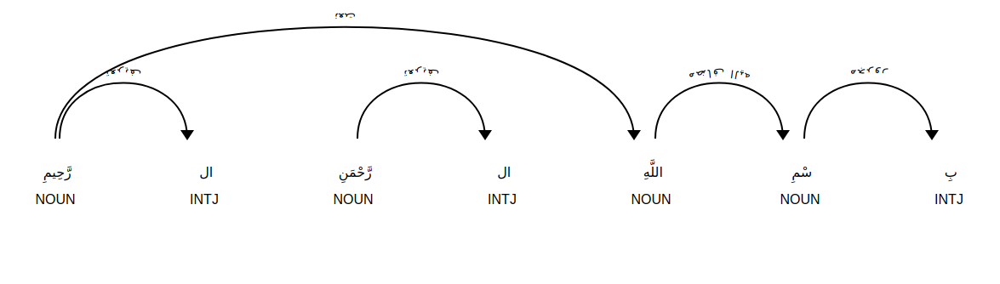
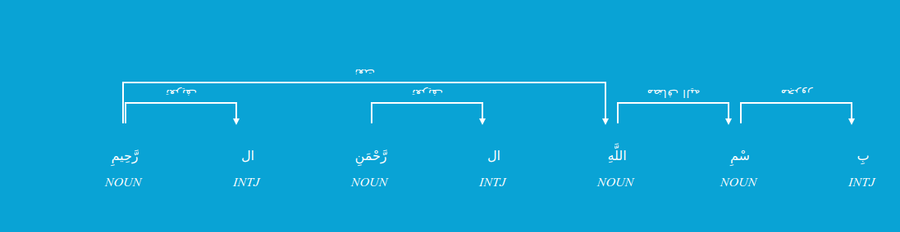

<!-- <h1 align="center">
  
   Dadmatools
</h1> -->

<h2 align="center">QuranicTools: A Python NLP Library for Quranic NLP</h2>

<div align="center">
  <a href="https://pypi.org/project/quranic-nlp/"></a>
  <a href=""></a>
  <a href="https://colab.research.google.com/github/language-ml/hadith-quranic_nlp/blob/main/notebooks/quranic_nlp_demo.ipynb"></a>
</div>

<div align="center">
  <h5>
      Part of Speech Tagging
    <span> | </span>
      Dependency Parsing
    <span> | </span>
      Lemmatizer
    <span> | </span>
      Multilingual Search    <br>
    <span> | </span>
      Quranic Extractions
    <span> | </span>
      Revelation Order
    <span> | </span> <br>
      Embeddings (coming soon)
    <span> | </span>
      Translations
  </h5>
</div>

# Quranic NLP

Quranic NLP is a computational toolbox to conduct various syntactic and semantic analyses of Quranic verses. The aim is to put together all available resources contributing to a better understanding/analysis of the Quran for everyone.

Contents:

- [Installation](#installation)
- [Pipeline](#pipeline)
- [Input Formats](#input-formats)
- [Verse Information](#verse-information)
- [Translations](#translations)
- [Similar Verses](#similar-verses)
- [Multiple Matches](#multiple-matches)
- [Word-level Analysis](#word-level-analysis)
- [JSON Output](#json-output)
- [Hadiths](#hadiths)
- [Visualization](#visualization)
- [Contributors](#contributors)
- [Contributing](#contributing)

## Installation

### Step 1 — Install the package

```bash
pip install quranic-nlp
```

### Step 2 — Download the data

The library requires data files (~97MB) that are downloaded separately from GitHub Releases:

```bash
quranic_data
```

Or from Python:

```python
from quranic_nlp.data_requirements import download_data
download_data()
```

Data is downloaded once and stored inside the package directory automatically.

## Development Setup

To set up a local development environment:

```bash
git clone https://github.com/language-ml/hadith-quranic_nlp.git
cd hadith-quranic_nlp
python -m venv .venv
source .venv/bin/activate   # On Windows: .venv\Scripts\activate
pip install -e .
quranic_data
```

## Pipeline

Available pipeline components:

| Key | Description |
|-----|-------------|
| `dep` | Dependency parsing |
| `pos` | Part-of-speech tagging |
| `root` | Root extraction |
| `lem` | Lemmatization |

```python
from quranic_nlp import language, utils, constant

pips = 'dep,pos,root,lem'
nlp = language.Pipeline(pips, translation_lang='fa#1')
```

To see all available translation languages and translators:

```python
utils.print_all_translations()
```

## Input Formats

Three ways to reference a verse:

```python
# 1. surah_number#ayah_number (no internet required)
doc = nlp('1#1')

# 2. surah_name#ayah_number (requires internet)
doc = nlp('حمد#1')

# 3. Free Arabic text — returns a list of all matching docs (requires internet)
docs = nlp('رب العالمین')
```

## Verse Information

```python
doc = nlp('1#1')

print(doc)                   # بِسْمِ اللَّهِ الرَّحْمَنِ الرَّحِیمِ
print(doc._.text)            # بِسْمِ اللَّهِ الرَّحْمَـٰنِ الرَّحِيمِ  (full diacritics)
print(doc._.surah)           # فاتحه
print(doc._.ayah)            # 1
print(doc._.revelation_order)  # 5
```

## Translations

Pass `'<lang>#<index>'` for a single translator (returns a string):

```python
nlp_en = language.Pipeline(pips, 'en#16')   # Yusuf Ali
doc = nlp_en('1#1')
print(doc._.translations)
# In the name of Allah, the Beneficent, the Merciful.
```

Pass `'<lang>'` (no index) for all translators (returns a `dict` keyed by translator name):

```python
nlp_fa = language.Pipeline(pips, 'fa')
doc = nlp_fa('1#2')
print(doc._.translations)
# {
#   'ansarian': 'همه ستایش ها، ویژه خدا، مالک و مربّی جهانیان است.',
#   'ayati':    'ستايش خدا را كه پروردگار جهانيان است.',
#   'bahrampour': 'ستايش خداى را كه پروردگار جهانيان است',
#   ...   # 12 Persian translators total
# }
```

## Similar Verses

`doc._.sim_ayahs` returns a list of `(ref, score)` tuples sorted by similarity score:

```python
doc = nlp('1#2')
for ref, score in doc._.sim_ayahs[:5]:
    print(f'{ref:10s}  score={score:.4f}')
```
```
37#182      score=1.0000
6#45        score=0.5199
40#65       score=0.4620
10#10       score=0.3862
39#75       score=0.3793
```

## Multiple Matches

When free Arabic text matches multiple verses, `nlp(text)` returns a **list of docs**:

```python
docs = nlp('رب العالمین')
print(f'Found {len(docs)} matching verses')
for doc in docs[:3]:
    print(doc._.surah, doc._.ayah, '—', doc._.text)
```
```
فاتحه 2 — الْحَمْدُ لِلَّهِ رَبِّ الْعَالَمِينَ
مائده 28 — لَئِن بَسَطتَ إِلَيَّ يَدَكَ...
انعام 45 — فَقُطِعَ دَابِرُ الْقَوْمِ...
```

You can also call `search_all` explicitly with a `max_results` cap:

```python
docs = language.search_all(nlp, 'رب العالمین', max_results=5)
```

## Word-level Analysis

```python
doc = nlp('1#1')
word = doc[2]  # third word: اللَّهِ

print(word)                            # اللَّهِ
print(word.pos_)                       # NOUN
print(constant.POS_UNI_FA[word.pos_]) # اسم
print(word.lemma_)                     # ٱللَّه
print(word._.root)                     # اله
print(word.dep_)                       # نعت
print(word._.dep_arc)                  # LTR  (Left-to-Right arc)
print(word.head)                       # رَّحِیمِ
```

Print a table of all words:

```python
print(f"{'Word':<20} {'POS':<8} {'Lemma':<15} {'Root':<10} {'Dep'}")
print('-' * 65)
for token in doc:
    print(f'{str(token):<20} {token.pos_:<8} {token.lemma_:<15} {str(token._.root):<10} {token.dep_}')
```

## JSON Output

```python
import json

result = language.to_json(pips, doc)
print(json.dumps(result, ensure_ascii=False, indent=2))
```
```json
[
  {"id": 1, "text": "بِ",      "root": "",    "lemma": "",       "pos": "INTJ", "rel": "مجرور",      "arc": "LTR", "head": "سْمِ"},
  {"id": 2, "text": "سْمِ",   "root": "سمو", "lemma": "ٱسْم",  "pos": "NOUN", "rel": "مضاف الیه", "arc": "LTR", "head": "اللَّهِ"},
  {"id": 3, "text": "اللَّهِ","root": "اله", "lemma": "ٱللَّه","pos": "NOUN", "rel": "نعت",        "arc": "LTR", "head": "رَّحِیمِ"},
  ...
]
```

## Hadiths

```python
hadiths = doc._.hadiths
if hadiths:
    print(f'Found {len(hadiths)} hadith(s)')
    print(hadiths[0])
else:
    print('No hadiths found or API unavailable.')
```

## Visualization

Render the dependency parse tree using spaCy's displacy:

```python
from spacy import displacy

options = {'compact': True, 'bg': '#09a3d5', 'color': 'white', 'font': 'Arial'}
displacy.render(doc, style='dep', options=options, jupyter=True)
```




## Contributors

- Seyyed Mohammad Aref Jahanmir
- Alireza Sahebi
- Doratossadat Dastgheyb
- Erfan Mohammadi
- Mahdi Ahmadi
- Ehsaneddin Asgari

📧 Contact: asgari [dot] berkeley [dot] edu

## Contributing

We warmly welcome contributions from the community! Whether you are a researcher, developer, linguist, or simply passionate about the Quran and NLP, there are many ways to get involved:

| Area | How to Help |
|------|-------------|
| New features | New pipeline components, morphological analyses, or language support |
| Data quality | Corrections to POS tags, dependency parses, lemmas, or roots |
| Translations | Add or improve Quranic translations for underrepresented languages |
| Testing | Help increase test coverage |
| Bug reports | Open an issue if something doesn't work as expected |
| Documentation | Clearer examples, tutorials, or API docs |

To contribute, fork the repository, make your changes, and open a pull request. For larger changes, please open an issue first to discuss your idea.

We believe open collaboration leads to better tools for everyone. Every contribution, big or small, is valued and appreciated.
